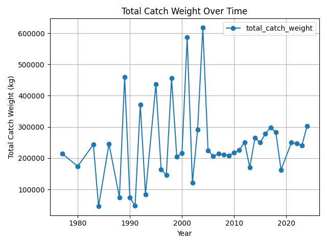
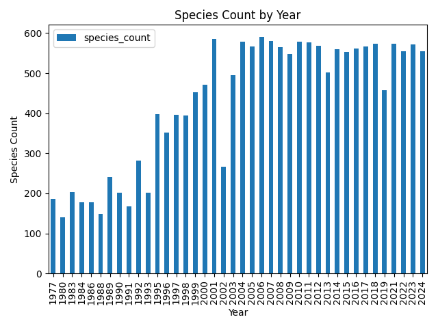

# **NOAA Fisheries Data Analysis**
### **Exploring West Coast Groundfish Bottom Trawl Survey (WCGBTS) Data with PostgreSQL and Python**

## **Project Overview**
This project processes and analyzes NOAA's **West Coast Groundfish Bottom Trawl Survey (WCGBTS)** dataset. It retrieves, cleans, and loads fisheries data into a **PostgreSQL database**, then performs exploratory data analysis using SQL and Python.

### **Key Features:**
-**Automated Data Retrieval:** Downloads NOAA WCGBTS data via RESTful API, creating a flexible tool that can adapt over time as new data is added to the survey.   
-**Database Integration:** Stores structured data in a **PostgreSQL** database, allowing fast querying, filtering, and structured storage without repeatedly loading large files.   
-**Data Cleaning & Standardization:** Uses `pandas` to preprocess raw data.   
-**SQL-Based Data Analysis:** Executes predefined queries to extract insights, simplifying repetitive analysis by storing queries and allowing the user to run them anytime.   
-**Visualizations:** Generates **trend plots & species distributions** using `matplotlib`.  

## **Project Structure**
```
NOAA_DATA/
│── data/                    # Stores downloaded raw data (CSV files)
│── db/                      # Standalone scripts for database queries
│   ├── fetch_db_data.py     # Retrieves and prints database records
│   ├── analyze_data.py      # Runs analysis & generates visualizations
│── sql/                     # SQL scripts for database operations
│   ├── create_tables.sql    # Defines database schema
│   ├── analysis_queries.sql # Contains reusable SQL queries
│── src/                     # Core processing modules
│   ├── api_client.py        # Handles API requests to NOAA
│   ├── data_processor.py    # Cleans and standardizes data
│   ├── db_manager.py        # Manages database connection & transactions
│── main.py                  # Orchestrates full ETL pipeline
│── README.md                # Project documentation
│── requirements.txt         # Dependencies for the project
```

---

## **Setup & Installation**
### **1️. Clone the Repository**
```bash
git clone https://github.com/emma-lewis/NOAA_Data.git
cd NOAA_Data
```

### **2️. Set Up a Virtual Environment**
```bash
python -m venv venv
source venv/bin/activate   # Mac/Linux
venv\Scripts\activate      # Windows
```

### **3️. Install Dependencies**
```bash
pip install -r requirements.txt
```

### **4️. Set Up PostgreSQL Database**
1. Install **PostgreSQL** and create a database:
   ```sql
   CREATE DATABASE noaa_data;
   ```
2. Create necessary tables:
   ```bash
   psql -U your_username -d noaa_data -f sql/create_tables.sql
   ```

### **5️. Run the Project**
#### **A. Download and Process Data**
```bash
python main.py
```
- This **downloads, cleans, and inserts** data into PostgreSQL.

#### **B. Fetch Sample Data**
```bash
python db/fetch_db_data.py
```

#### **C. Run Analysis & Generate Visualizations**
```bash
python db/analyze_data.py
```

---

## **Visualizations**
### **Total Catch Weight Over Time**
**What it shows:** Trends in **total fish catch weight per year**.



---

### **Species Count by Year**
**What it shows:** **Number of unique species caught per year**.



---

## **Acknowledgments**
This project uses publicly available fisheries data from the **West Coast Groundfish Bottom Trawl Survey** from NOAA's FRAM Data Warehouse.   

**Contact:** emlew21@gmail.com | https://github.com/emma-lewis

[def]: data/Total_Catch_Weight.png
[def2]: data/Total_Catch_Weight.png
[def3]: data/Species_Count.png